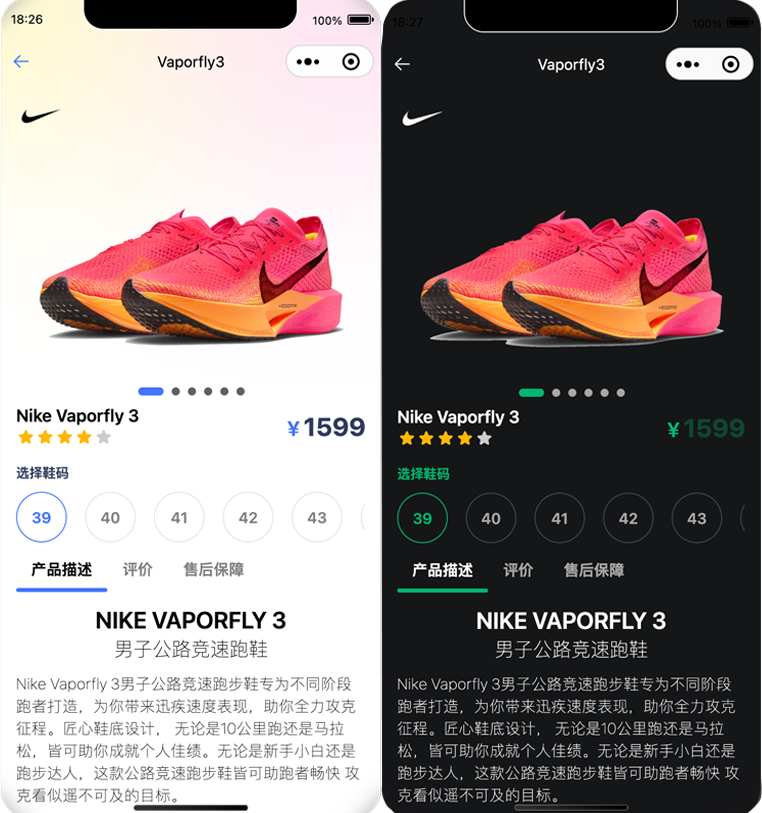

    <iframe src="https://h5.geui.xyz/#/pages/index/index" height="740px"></iframe>

# GE-Ui 

## 项目介绍
GE-Ui是一个基于uni-app的ui项目。目前只针对H5、微信测试，其他平台慎用。

后续计划会推出微信小程序原生组件项目。

[在线文档(https://geui.xyz)](https://geui.xyz)

[GitHub(https://github.com/JameChou/geui)](https://github.com/JameChou/geui)

[uniapp地址 https://ext.dcloud.net.cn/plugin?id=14013](https://ext.dcloud.net.cn/plugin?id=14013)

## 微信小程序、H5 

## 示例效果

## 反馈
联系作者: zhouxy.vortex@gmail.com / QQ: 252410130

或者在本项目上提issue